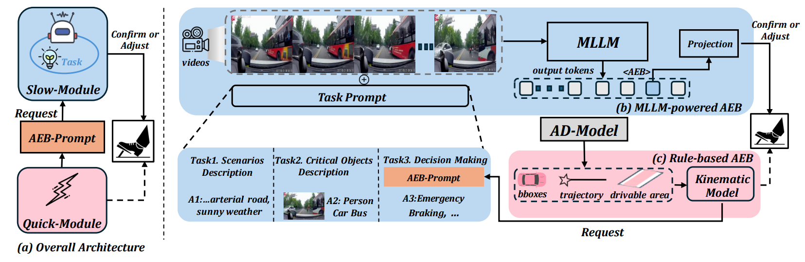

<h1 align="center">Dual-AEB: Synergizing Rule-Based and Multimodal Large Language Models for Effective Emergency Braking</h1>

<p align="center">
<a href="https://arxiv.org/pdf/2410.08616"></a>
<a href="https://www.youtube.com/watch?v=KbN-mJnXu08"></a>
<a href="https://github.com/ChipsICU/Dual-AEB/blob/main/LICENSE"></a>
</p>

<h4 align="center"><em><a href="https://github.com/ChipsICU">Wei Zhang</a>*, 
<a href="https://github.com/Philipflyg">Pengfei Li</a>*,
<a href="https://github.com/wjl2244">Junli Wang</a>, 
<a href="#">Bingchuan Sun</a>, 
<a href="#">Qihao Jin</a>, 
<a href="#">Guangjun Bao</a>, 
<a href="#">Shibo Rui</a>, 
<a href="#">Yang Yu</a>, 
<a href="#">Wenchao Ding</a>, 
<a href="#">Peng Li</a>📧, 
<a href="#">Yilun Chen</a>📧</em>
</h4>

<h5 align="center">
<br>* indicates equal contribution, and 📧 indicates corresponding authors.<br>
<b > AIR, Tsinghua University &nbsp; | &nbsp; Lenovo Research  &nbsp; | &nbsp; HIT &nbsp; | &nbsp; CASIA | &nbsp; Fudan University </b>
<a></a>
</h5>

## Abstract
<a align="docs/images/pipeline.png"></a>
______

Automatic Emergency Braking (AEB) systems are a crucial component in ensuring the safety of passengers in autonomous vehicles. Conventional AEB systems primarily rely on closed-set perception modules to recognize traffic conditions and assess collision risks. To enhance the adaptability of AEB systems in open scenarios, we propose Dual-AEB, a system combines an advanced multimodal large language model (MLLM) for comprehensive scene understanding and a conventional rule-based rapid AEB to ensure quick response times. To the best of our knowledge, Dual-AEB is the first method to incorporate MLLMs within AEB systems. Through extensive experimentation, we have validated the effectiveness of our method.

---

## Notes
2024-10-11: **Initialization**.
**2025-01-28**: Dual-AEB has been accepted by **ICRA 2025** !  :rocket:
2025-02-27: Uploading Dual-AEB **training pipeline**.

## Citation
If you find this work useful in your research, please consider cite: 

```
@misc{zhang2024dualaebsynergizingrulebasedmultimodal,
      title={Dual-AEB: Synergizing Rule-Based and Multimodal Large Language Models for Effective Emergency Braking}, 
      author={Wei Zhang and Pengfei Li and Junli Wang and Bingchuan Sun and Qihao Jin and Guangjun Bao and Shibo Rui and Yang Yu and Wenchao Ding and Peng Li and Yilun Chen},
      year={2024},
      eprint={2410.08616},
      archivePrefix={arXiv},
      primaryClass={cs.RO},
      url={https://arxiv.org/abs/2410.08616}, 
}
```

## Acknowledgments

We thank all the authors who made their codes and datasets public, which tremendously accelerates our project progress. If you find these works helpful, please consider citing them as well.

[MM-AU](https://github.com/jeffreychou777/LOTVS-MM-AU)
[Bench2DriveZoo](https://github.com/Thinklab-SJTU/Bench2DriveZoo/tree/uniad/vad)
[LLaVA-OneVision](https://github.com/LLaVA-VL/LLaVA-NeXT/)